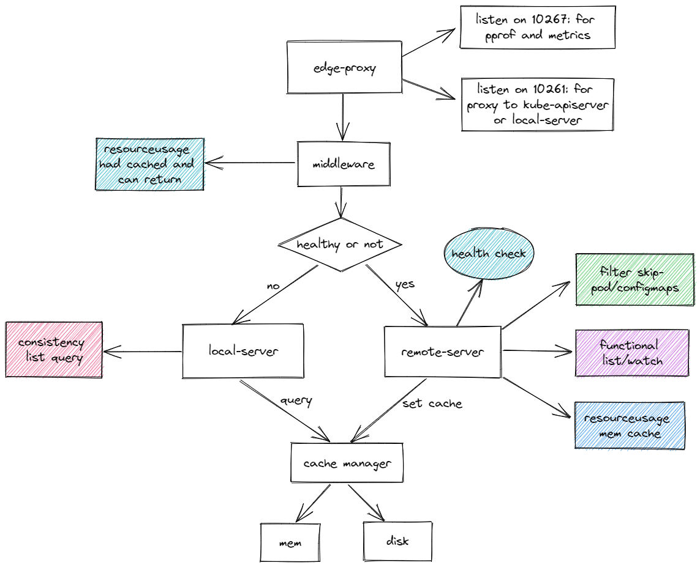

<!-- START doctoc generated TOC please keep comment here to allow auto update -->
<!-- DON'T EDIT THIS SECTION, INSTEAD RE-RUN doctoc TO UPDATE -->
**Table of Contents**  *generated with [DocToc](https://github.com/thlorenz/doctoc)*

- [edge-proxy](#edge-proxy)
  - [arch design](#arch-design)
  - [notice](#notice)
  - [tree](#tree)
  - [build binary](#build-binary)
  - [local test use minikube not in cluster(use kubeconfig)](#local-test-use-minikube-not-in-clusteruse-kubeconfig)
  - [docker build and push](#docker-build-and-push)
  - [edge ack cluster test](#edge-ack-cluster-test)
  - [docker-build and gen manifest yaml file](#docker-build-and-gen-manifest-yaml-file)
  - [deploy benchmark pod](#deploy-benchmark-pod)
  - [retest](#retest)
  - [acknowledgement](#acknowledgement)

<!-- END doctoc generated TOC please keep comment here to allow auto update -->

## edge-proxy

### arch design



### notice

仓库共包含 5 个分支，对应 5 个不同的解决方案

- master：目前排行榜上的代码，对 labelSelector 进行判断以及对响应体裁剪
- labelSelector-cachemgr：通用的 labelSelector cachemgr，由于主办方说不建议使用
- resourceusage label 进行判断，所以使用了通用的 labelSelector cachemgr
- origintype：响应体未压缩的代码，资源分 5w+
- protobuf：使用 protobuf 协议的代码，接收 protobuf 格式响应体
- 11-fix-solve-concurrent-coroutine-request-problem：由于大赛测评程序使用了一个协程进行压测，其他分支的 map 没有考虑并发读写安全以及缓存击穿的问题，这个分支做了对应的修改适配

### tree

- `pkg/kubernetes`

```
├── config        // use kubeconfig for benchmark local test
├── health        // for apiserver health check livez
└── types         // define struct for apiserver list result
```

- `pkg/proxy/dev`

```
├── cachemgr.go         // cache apiserver list result
├── cachemgr_test.go    // unit test
├── checker.go          // remote server health check
├── common.go           // const define
├── filter.go           // for filter benchmark
├── handler.go          // edge-proxy handler
├── infra.go            // apiserver interface define
├── local.go            // local proxy for consistency benchmark
└── remote.go           // remote proxy
```

- `pkg/benchmark`

```
├── benchmark-consistency.go
├── benchmark-filter.go
├── benchmark-functional.go
├── benchmark-resourceusage.go // use pprof and timer for benchmark
```

### build binary

```
make build
```

make build 命令会生成两个二进制:edge-proxy 和 benchmark, 存放在目录：_output/local/bin/{GOOS}/{GOARCH}/

* edge-proxy 是本次比赛的框架代码，选手可以根据里面的主体逻辑实现对应的功能。
* benchmark 是提供的一个用于本地调试 edge-proxy 功能的工具，选手也参照 benchmark 提供的代码，对 edge-proxy 更详细的测试。

### local test use minikube not in cluster(use kubeconfig)

```sh
export server_addr=$(kubectl config view --minify -o=jsonpath="{.clusters[*].cluster.server}")
export ns=$(kubectl get cm kube-root-ca.crt -o=jsonpath="{.metadata.namespace}")
./edge-proxy --server-addr ${server_addr} --use-kubeconfig true --enable-sample-handler true --disk-cache-path ~/.kube/cloudnative-challenge/cache
./benchmark --namespace ${ns} --use-kubeconfig
```

### docker build and push

````sh
make docker-build IMAGE_REPO=registry.cn-shanghai.aliyuncs.com/cloud-native-edge-proxy IMAGE_TAG=v0.0.1 REGION=cn
````

### edge ack cluster test

```sh
alias kubectl='kubectl --kubeconfig ~/.kube/cloudnative-challenge/config'
```

### docker-build and gen manifest yaml file

`make docker-build` 命令用于生成并push edge-proxy镜像 和并且产生用于本地测试的 manifest 文件

参数解析：

* IMAGE_REPO 指定镜像 repo
* IMAGE_TAG 指定镜像 tag
* REGION 指定是否需要代理
* DOCKER_USERNAME 指定阿里云镜像仓库的用户名
* DOCKER_PASSWD 指定阿里云镜像仓库的密码

```
make docker-build IMAGE_REPO=registry.cn-shanghai.aliyuncs.com/cloudnative-challenge IMAGE_TAG=v1.0 REGION=cn DOCKER_USERNAME=** DOCKER_PASSWD=**
```

若 `make docker-build` 命令执行成功， 会自动 push 镜像到对应的阿里云镜像仓库中，并且在`_output/` 目录下生成 `manifest.yaml` 文件。
`manifest.yaml` 文件里主要包括了测试的pod资源对象。

### deploy benchmark pod

`kubectl apply -f _output/manifest.yaml`

执行后， 会在对应命名空间下生成名字为 benchmark 的 pod 对象，此 pod 包含了两个容器， 一个是 edge-proxy 的容器， 一个是 benchmark 的容器， 可以使用 kubectl 命令查看:

`kubectl get pod benchmark -o yaml`

```
# 查看 bench-mark 容器日志: 
kubectl logs -f benchmark bench-mark

# 查看 edge-proxy 容器日志:
kubectl logs -f benchmark edge-proxy
```

### retest

1. 修改 edge-proxy 代码逻辑
2. 执行 `make docker-build` 命令， 重新构建镜像，并 push 镜像
3. 删掉测试 pod

```
kubectl delete -f _output/manifest.yaml
```

4. 重新创建测试 pod

```
kubectl apply -f _output/manifest.yaml
```

### acknowledgement

- [openyurt](https://github.com/openyurtio/openyurt)
